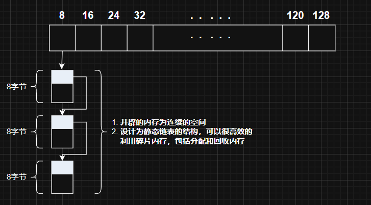

# 内存池设计解析
## 目录
- [一、内存池粒度定义](#一内存池粒度定义)
- [二、内存池结构图](#二内存池结构图)
- [三、自由链表的表头结构](#三自由链表的表头结构)
  - [3.1 关于 Obj 联合体的设计](#31-关于-obj-联合体的设计)
- [四、链表和静态成员](#四链表和静态成员)
- [五、两个重要辅助函数](#五两个重要辅助函数)
  - [5.1 roundUp 函数](#51-roundup-函数)
  - [5.2 freeListIndex 函数](#52-freelistindex-函数)
- [六、内存分配](#六内存分配)
  - [6.1 allocate 函数](#61-allocate-函数)
  - [6.2 S_refill 函数](#62-s_refill-函数)
  - [6.3 S_chunk_alloc 函数](#63-s_chunk_alloc-函数)
## 一、内存池粒度定义
```cpp
enum { ALIGN = 8 };                      // 内存对齐
enum { MAX_BYTES = 128 };                // 最大分配块
enum { NFREELISTS = MAX_BYTES / ALIGN }; // 自由链表数组大小
```
## 二、内存池结构图

## 三、自由链表的表头结构
```cpp
union Obj {
    Obj* next;       // 指向下一个块
    char data[1];    // 占位数据
};
```
### 3.1 关于Obj联合体的设计
#### 1. 为什么需要 char data[1] ?
"柔性数组" `M_client_data[1]` 只是个占位符,当 malloc 分配一块足够大的内存时，Obj 结构体会占据前面的一部分，后续的空间会直接作为 M_client_data 来存放数据。整个 Obj 结构体和数据部分是连续的，避免了额外的指针存储和碎片化。

当 malloc 分配 128 字节时：
```cpp
Obj* object = (Obj*)malloc(sizeof(Obj) + 128);
```
* sizeof(Obj) 是 M_free_list_link 指针的大小：8（64位系统）
* malloc 分配的总大小是 sizeof(Obj) + 128
    * Obj 占 8 字节
    * 128 字节的数据区域从 M_client_data[1] 之后开始

#### 2. 为什么是字节数组?
在 C/C++ 中，`char*`（或 `unsigned char*`）被定义为 **“可以合法访问任何内存”** 的指针类型

因为char的大小是 1 字节，所以可以逐字节访问内存的原始内容

#### 3. 空白内存需要分块构建成链表的形式，但是为什么是用union，而不是struct?
**（1）union 支持类型双关**：`类型双关` 是指 `同一块内存被不同的类型解释` ，所以用union来设计的巧妙在于这块内存的双重身份，可以别名同一内存

 ① 空闲时→作为_Obj链表节点

* 内存刚分配出来的时候会转换为obj（S_refill函数中再详细介绍），此时作为链表节点，内部next指针存储下一块节点位置

② 分配时 → 作为用户内存

* 直接返回 char* 指针给用户，用户可自由使用整个块（包括原指针占用的空间）
* 用户数据会覆盖，因为链表已解除链接，这块内存交给了用户去管理，所以不用记录
  
**（2）union成员共享内存**
* union的内存大小由最大成员决定，而struct每个成员占用独立空间，还要进行内存对齐
```cpp
struct _Obj { 
    _Obj* next;  // 8字节
    char data[1];   // 1字节（需要考虑内存对齐，实际上要大一些）
};

union _Obj{      //大小为next的大小，8字节
 _Obj* next; 
 char data[1]; 
 } 
```
* 写入 next 后，可以用 data 访问相同的内存
## 四、链表和静态成员
```cpp
Obj* freeList[NFREELISTS] = {nullptr}; // 自由链表
char* startFree = nullptr;             // 新分配内存池起始地址
char* endFree = nullptr;               // 新分配内存池结束地址
size_t heapSize = 0;                   // 记录已分配的堆大小
```

## 五、两个重要辅助函数
```cpp
size_t roundUp(size_t bytes) {return (bytes + ALIGN - 1) & ~(ALIGN - 1);}

size_t freeListIndex(size_t bytes) {return (bytes + ALIGN - 1) / ALIGN - 1;}   
```
### 5.1 roundUp函数
将bytes向上对齐到 ALIGN 的倍数

| `bytes` | `roundUp` |
| --- | --- |
| 3 | 8 |
| 8 | 8 |
| 9 | 16 |
| 16 | 16 |
| 17 | 24 |    
### 5.2 freeListIndex函数
计算给定 bytes（内存块的字节大小）对应的自由链表索引，也就是这块内存在freelist数组的什么位置

| `bytes` | `freeListIndex` |
| --- | --- |
| 1  | 0  |
| 8  | 0  |
| 9  | 1  |
| 16 | 1  |
| 17 | 2  |
| 24 | 2  |

## 六、内存分配
### 6.1 allocate函数
#### 流程图

### 6.2 S_refill函数
{:style="width: 70%"}
### 6.3 S_chunk_alloc函数
